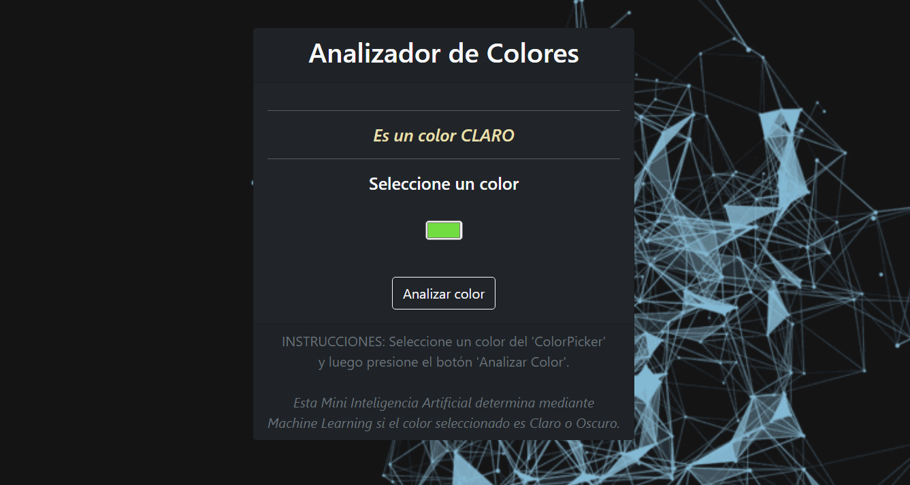

# Analizador de Colores (Inteligencia Artificial)

_Mini Inteligencia Artificial Simple en JavaScript (Machine Learning) de identificación de colores claros y oscuros, con el uso de la librería Brain.js._

## Link del proyecto 🚀

_[Analizador](https://analizadordecolores.netlify.app)_

## Autor ✒️

**Luis Correa** - *Desarrollo de la aplicación* - [GitHub](https://github.com/luisCorreaCespedes)

## Expresiones de Gratitud 🎁

* Si les gusta el proyecto pongan su ⭐️
* Mini aplicación hecha con muchas tazas de café ☕. 
* Gracias a todos mis amigos por apoyarme a crear videojuegos aunque sean simples 🤓.

